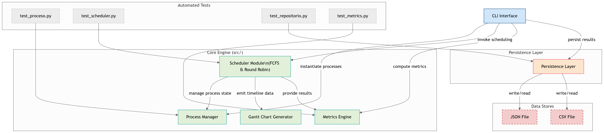
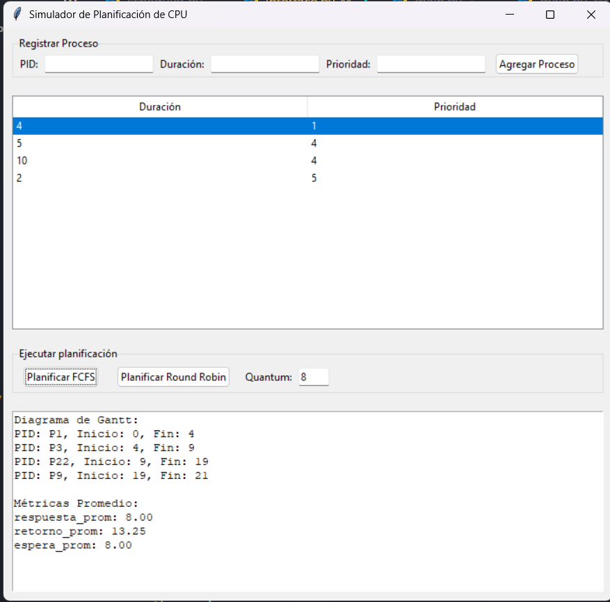

https://github.com/Alvarojorgeg/examen-planificacion-cpu

# Simulador de Planificación de CPU (con Interfaz Gráfica)



Este proyecto implementa un simulador de planificación de procesos de CPU utilizando Python, programación orientada a objetos y una interfaz gráfica desarrollada con **Tkinter**.

🔧 **Desarrollado por Álvaro**, estudiante de Ingeniería Informática.

---

## 🖥️ Interfaz Gráfica (GUI)

El sistema cuenta con una GUI completa donde puedes:

- Registrar procesos (PID, duración, prioridad)
- Visualizar procesos en una tabla interactiva
- Ejecutar planificación con:
  - FCFS (First-Come, First-Served)
  - Round Robin (con quantum configurable)
- Ver resultados:
  - Diagrama de Gantt
  - Métricas promedio: tiempo de respuesta, espera y retorno



---

## 📁 Estructura del Proyecto

```
proyecto-scheduler/
├── src/
│   ├── core/
│   │   ├── proceso.py
│   │   ├── scheduler.py
│   │   ├── repositorio.py
│   │   └── metrics.py
│   └── gui/
│       └── interface.py
├── tests/
│   ├── test_proceso.py
│   ├── test_scheduler.py
│   ├── test_repositorio.py
│   └── test_metrics.py
├── main.py  ← Ejecuta la GUI
├── requirements.txt
└── README.md
```

---

## ▶️ Cómo Ejecutar

1. (Opcional) Crear entorno virtual:
```bash
python -m venv venv
venv\Scripts\activate  # Windows
```

2. Instalar dependencias:
```bash
pip install -r requirements.txt
```

3. Ejecutar la interfaz gráfica:
```bash
# Desde raíz del proyecto:
$env:PYTHONPATH="src"  # PowerShell (o set PYTHONPATH=src en CMD)
python main.py
```

---

## 🧪 Ejecutar Pruebas Automáticas

El proyecto incluye tests con `pytest`. Puedes correrlos así:

```bash
pytest
```

---

## 📌 Notas Finales

✅ Estructura profesional con separación entre lógica (`core`) y presentación (`gui`)
✅ Código modular, probado y validado
✅ Cobertura de casos clave con interfaz clara para el usuario

Este proyecto fue desarrollado como ejercicio práctico de sistemas operativos y planificación de procesos, con enfoque en buenas prácticas y experiencia de usuario.

---

💻 *Hecho con dedicación por Álvaro – Ingeniería Informática.*